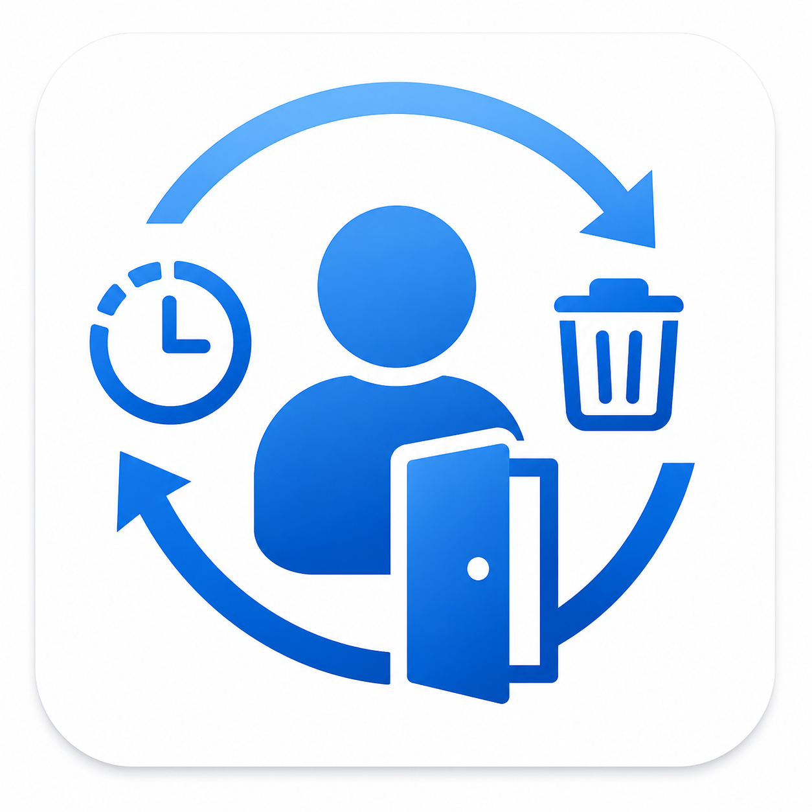

# M365AutoRevocate



Automated offboarding cleanup for Microsoft 365, driven by Microsoft Graph
change notifications and configured from a small admin web app.

The tool maintains its own Graph subscription and, when a monitored user goes
**inactive**, is **disabled**, or is **deleted**, runs the offboarding actions
you have enabled. It authenticates with a **managed identity** only - no client
secrets or certificates.

## What it can do

Each action can be configured to run **at inactive**, **at disable**, **at
delete**, or any combination. Boxes that make no sense at a given moment (e.g.
mailbox actions after deletion) grey out.

| Action | At inactive | At disable | At delete |
|--------|:----------:|:---------:|:--------:|
| Stop sharing the OneDrive (remove every sharing link/grant) | ✓ | ✓ | ✓ |
| Notify manager of owned artifacts (fallback: service desk) | ✓ | ✓ | ✓ |
| Revoke sign-in / refresh tokens | ✓ | ✓ | - |
| Set an auto-reply on the mailbox | ✓ | ✓ | - |
| Add a mailbox forward (inbox rule) | ✓ | ✓ | - |
| Cancel meetings the user organised & notify attendees | ✓ | ✓ | - |
| Remove directly assigned licences | ✓ | - | - |
| Remove group memberships | ✓ | - | - |
| Soft delete the account (always runs last) | ✓ | - | - |

For **delete**, you choose **soft** (acts when the user hits the recycle bin) or
**hard** (acts once the user is permanently deleted - at the latest one day
before the automatic 30-day purge). See [docs/architecture.md](docs/architecture.md).

## Inactive-user monitoring

A daily scan flags enabled accounts with no successful sign-in
(`signInActivity.lastSuccessfulSignInDateTime`) for the configured number of
days and runs the inactive-trigger actions on them. Never-signed-in accounts
age from their **creation date**, so new accounts are safe. Requires an **Entra
ID P1** licence (the sign-in activity property is premium).

## Global exclusions (never touched)

Some accounts must never be offboarded by anything, at **any** trigger (inactive,
disable *or* delete):

- **Exclusion group** - an Entra security group whose (transitive) members are
  ignored everywhere. Use it for break-glass and service accounts.
- **Shared / room / equipment mailboxes** - detected from Exchange
  (`RecipientTypeDetails`, keyed to the Entra object id) since Graph has no
  mailbox-type property. On by default. These are commonly disabled or never
  signed in, but must stay.

Both are enforced wherever the tool would act or enqueue work. They are reliable
while the account still exists (inactive/disable); at the delete trigger the
object is already gone from the directory and Exchange, so exclusion there is
best-effort. If a configured exclusion source can't be read, the tool **fails
closed** (skips rather than risk acting on a protected account) - so the shared-
mailbox exclusion needs the managed identity's `View-Only Recipients` Exchange
role (granted by the deploy); turn the option off if you don't want that
dependency.

## Admin web app

The deploy publishes a small **static web app in the storage account**. The
first sign-in runs a short **setup wizard** (delete timing, inactive monitoring,
threshold, exclusion group) followed by a quick callout tour. After that, admins
can:

- toggle each action's inactive/disable/delete triggers and set their options
  (auto-reply text, forward address, cancellation note),
- adjust the timing, service desk address, and inactivity settings,
- view a live activity log of everything the tool has done.

It uses **delegated Entra sign-in** (MSAL) and is restricted to an **Entra
security group** you nominate. The behavioural config lives in a JSON blob in the
storage account, so edits take effect with no redeploy. See
[docs/web-app.md](docs/web-app.md).

## How it works

- A Graph subscription on `/users` (`updated,deleted`) calls an HTTP function.
  `deleted` drives the delete trigger; `updated` is checked for an
  `accountEnabled → false` transition to drive the disable trigger.
- A daily **inactivity scan** drives the inactive trigger (when enabled).
- Events are queued and processed asynchronously (OneDrive cleanup can take a
  while; Graph needs a fast callback).
- A daily **directory snapshot** (mandatory, auto-seeded at deploy time) caches
  each user's manager and ownership *before* deletion - Graph erases those
  relationships on delete, so they must be captured ahead of time.
- Sending the hand-off email uses **Exchange Online RBAC for Applications**,
  scoped to a single sender mailbox - there is no tenant-wide `Mail.Send`.

Diagram and details: [docs/architecture.md](docs/architecture.md).

## Quick start

Prerequisites (authorisation, needed for **both** methods below): **Global
Administrator / Privileged Role Administrator** to consent the Graph permissions
and register the web app; **Exchange Administrator** (the deploy connects to
Exchange Online as the signed-in user to scope mailbox send); and an **Entra
security group** for the web-app admins. Azure Cloud Shell already provides the
tooling (Azure CLI + PowerShell); for a local install you also need the
[Azure CLI](https://aka.ms/azcli) and the `ExchangeOnlineManagement` module (the
deploy installs it if missing).

The deploy derives the target tenant from the sender's domain and forces the az
sign-in there, so you cannot deploy into the wrong tenant.

### Fastest: one line in Azure Cloud Shell (recommended)

1. Open [Azure Cloud Shell](https://shell.azure.com) and choose **PowerShell**
   (you are already signed in to Azure there).
2. Run:

   ```powershell
   iex (irm https://raw.githubusercontent.com/jflieben/M365AutoRevocate/main/install.ps1)
   ```

The installer downloads the **latest release**, asks for the five settings
(subscription id, region, sender mailbox, service desk email, admin group) and
runs the full deployment. To pin a version or run it unattended, download it and
pass parameters instead:

```powershell
irm https://raw.githubusercontent.com/jflieben/M365AutoRevocate/main/install.ps1 -OutFile install.ps1
./install.ps1 -SubscriptionId <sub> -Location westeurope `
    -SenderUpn noreply@contoso.com -ServicedeskEmail servicedesk@contoso.com `
    -AdminGroupName "M365AutoRevocate Admins" -Tags @{ CostCentre = '1234' }
```

### From a local clone

```powershell
./deploy/Deploy-M365AutoRevocate.ps1 `
    -SubscriptionId   <your-subscription-id> `
    -Location         westeurope `
    -ServicedeskEmail servicedesk@contoso.com `
    -SenderUpn        noreply@contoso.com `
    -AdminGroupName   "M365AutoRevocate Admins"
```

Add `-Tags @{ CostCentre = '1234'; Env = 'prod' }` if your tenant requires tags
on the resource group. Delete timing (soft vs hard) is chosen in the setup
wizard, not on the command line.

Either method provisions everything (resource group, storage, Application Insights,
Flex Consumption Function App + managed identity), grants Graph permissions and
storage roles, sets up mailbox-scoped mail via Exchange Online, deploys the code,
publishes the web app, registers the subscription, and prints the **admin web app
URL**.

When it finishes it prints only the follow-up steps that are actually still
needed (e.g. consent, when the signed-in account could not grant the Graph
roles itself) - the directory snapshot is seeded automatically. Then open the
web app: the **setup wizard** takes it from there. The tool starts in
**simulation (dry run)** mode; when you are confident, turn it off under
**Configuration &rarr; Simulation mode** in the web app.

## Permissions (summary)

Managed-identity Graph app roles: `User.ReadWrite.All`, `User.DeleteRestore.All`,
`Directory.Read.All`, `GroupMember.ReadWrite.All`, `AuditLog.Read.All`,
`Sites.FullControl.All`, `MailboxSettings.ReadWrite`, `Calendars.ReadWrite`.
Mail **sending** is granted separately and narrowly via Exchange Online RBAC
scoped to the sender mailbox. Reading **mailbox types** (to exclude shared/room/
equipment mailboxes) needs `Exchange.ManageAsApp` on *Office 365 Exchange Online*
plus the `View-Only Recipients` Exchange role. Storage data plane uses AAD (no
keys). Full rationale and how to tighten: [docs/permissions.md](docs/permissions.md).

## Network access

The admin console and its API should **not** be reachable from the whole
internet. By default the deploy locks both public surfaces down:

- **Function App** (admin API + the Graph webhook): App Service access
  restrictions allow only your public IP, with the unmatched rule action set to
  **block**. It *also* allows Microsoft Graph's change-notification ranges so
  deletions/disables keep arriving:
  `20.20.32.0/19`, `20.190.128.0/18`, `20.231.128.0/19`, `40.126.0.0/18`
  (row #23 of Microsoft's
  [additional Office 365 IP addresses and URLs](https://learn.microsoft.com/en-us/microsoft-365/enterprise/additional-office365-ip-addresses-and-urls?view=o365-worldwide);
  Microsoft can change these, so re-check that page and update the rules if the
  webhook stops receiving).
- **Admin web site** (its own storage account, `arweb<suffix>`): storage firewall
  default action **Deny**, allowing only your public IP.

The deploy detects your current public IP automatically and prints exactly which
IP(s) it allowed at the end.

The **state** storage account (`arevoc<suffix>`) is deliberately left open: the
tool reaches its Table/Blob/Queue over the public endpoints via AAD, and the
Functions host needs account-level access. Only the two *inbound* surfaces above
are restricted.

**Changing who can reach it:**

- Allow another IP/CIDR at deploy time: add `-AllowedAdminIp <ip-or-cidr>` (repeatable)
  to `Deploy-M365AutoRevocate.ps1`. Re-running is idempotent (it replaces the
  `AR-*` rules).
- In the portal: **Function App > Networking > Access restrictions** (keep the
  `AR-Graph-*` rules), and **storage account `arweb<suffix>` > Networking**.
- To opt out entirely (leaves both surfaces public, **not recommended**): pass
  `-SkipNetworkLockdown`. Only do this if you front the app with your own network
  controls (e.g. a corporate proxy / Front Door with WAF).

Note: the admin API is defence-in-depth already (App Service Easy Auth + an
in-function token check, restricted to the admin security group), so a locked-out
IP fails safe. The network lockdown simply removes the surface from the open
internet.

## Configuration

Infra settings live in Function App application settings (written by deploy).
**Behavioural** settings - delete timing, service desk, inactivity monitoring,
and the per-action trigger matrix with option values - live in a config **blob**
and are edited from the web app (or by editing `config.json` in the
`autorevocate-config` container).

| App setting | Meaning |
|-------------|---------|
| `AR_SENDER_UPN` | Mailbox the hand-off email is sent from |
| `AR_SERVICEDESK_EMAIL` | Seed service desk address for the config blob until first save |
| `AR_NOTIFICATION_URL`, `AR_CLIENT_STATE`, `AR_TABLE_ENDPOINT`, `AR_BLOB_ENDPOINT` | Endpoints / validation token (set by deploy) |

> **Simulation (dry run)** is a behaviour setting in the config blob, edited from
> the web app (**Configuration &rarr; Simulation mode**), not an app setting. New
> installs start in simulation until you turn it off.

## Limitations & caveats

- **Manager/ownership need the snapshot.** Graph drops those on deletion, so the
  delete-time manager email and artifact list depend on the daily snapshot.
- **Disable detection is best-effort.** `updated` notifications don't say what
  changed, so the tool reads `accountEnabled` per notification. High-volume in
  large tenants; it short-circuits when no disable-actions are enabled.
- **Hard-delete timing is poll-based** (reconciler schedule); it acts when the
  account is purged or one day before the automatic 30-day purge.
- **Inactivity detection needs Entra ID P1** (`signInActivity` is premium) and
  the threshold has a 7-day floor as a typo guard.
- **Broad mailbox/calendar/group permissions** are unavoidable for actions that
  act on arbitrary departing users. Sending stays narrowly scoped.
- Validate on first deploy in **simulation mode** (on by default) before turning it off to enable destructive actions.
- **Multi-geo OneDrive:** the personal-site host is derived for the tenant's
  default geo; satellite-geo OneDrives may not resolve.
- **The state storage account must keep public network access** (the tool
  reaches its Table/Blob/Queue over the public endpoints via AAD). The deploy's
  network lockdown restricts only the two *inbound* surfaces (Function App + admin
  web site), never the state account - see [Network access](#network-access).
- **Sovereign clouds:** endpoint overrides exist (`AR_GRAPH_RESOURCE`,
  `AR_STORAGE_RESOURCE`, `AR_LOGIN_HOST`) but are untested; commercial cloud is
  the supported target.
- **Large-tenant first snapshot:** the directory snapshot is delta-based and
  checkpointed, so the very first full pass in a 100k+ tenant can span several
  nightly runs before manager/ownership data is complete for everyone.
- **Data handling / privacy:** the tool caches personal data (managers,
  ownership, UPNs) to function after deletion - see [docs/privacy.md](docs/privacy.md).

See also [SECURITY.md](SECURITY.md) and [CHANGELOG.md](CHANGELOG.md).

## Repository layout

```
install.ps1                          One-line bootstrap (iex) -> latest release -> deploy
deploy/Deploy-M365AutoRevocate.ps1   Onboarding script (idempotent)
deploy/Update-M365AutoRevocate.ps1   Fast, non-interactive code/web update
deploy/Remove-M365AutoRevocate.ps1   Uninstaller (-KeepData / -SkipExchange)
.github/workflows/ci.yml             CI: analyze + test, plus auto-release on VERSION bump
src/                                 Function App
  Modules/AutoRevocate/              Logic (Graph, storage, config, actions, mail, safety, auth)
  NotificationHandler/               HTTP: Graph callback
  RevocationProcessor/               Queue: run/queue cleanup (inactive + disable + delete)
  SubscriptionManager/               Timer: create/renew subscription
  HardDeleteReconciler/              Timer: hard-delete polling
  DirectorySnapshot/                 Timer: manager/ownership cache (delta + batch)
  InactivityScanner/                 Timer: daily inactive-user scan
  ReconciliationSweep/               Timer: enqueue events missed by notifications
  ActivityLogCleanup/                Timer (weekly): log retention + snapshot prune
  Watchdog/                          Timer: daily health alert to the service desk
  VersionChecker/                    Timer (weekly, randomised): update check
  ConfigApi / LogsApi / StatusApi/   HTTP admin API (behind Easy Auth + token check)
  GroupsApi / PreviewApi / ResumeApi/  HTTP admin API (autocomplete, what-if, resume)
web/                                 Admin SPA (wizard, matrix, log viewer, banners)
tests/                               Pester unit tests
docs/                                architecture, permissions, web-app, opportunities, privacy, operations
SECURITY.md  CHANGELOG.md  LICENSE  VERSION
```

## Safety (circuit breaker)

Because a single mistake elsewhere (a mass disable, an accidental directory-sync
deletion, turning on inactivity monitoring in an old tenant) could otherwise
cascade into thousands of irreversible cleanups, the tool has a **circuit
breaker**: configurable per-trigger daily caps and a percent-of-directory
ceiling. When a run would exceed a limit it **pauses all processing** and shows a
"review & resume" banner in the web app; queued work is held (not lost) until an
admin resumes. Combined with dry-run (on by default) and the exclusion group,
this is what makes the tool safe to point at a large tenant. See
[SECURITY.md](SECURITY.md).

## Upgrading

```powershell
./deploy/Update-M365AutoRevocate.ps1 -SubscriptionId <sub> -SenderUpn noreply@contoso.com
```

Redeploys the function code and web app and stamps the new version. It does not
touch identity, RBAC, Graph consent, or Exchange Online, so there are no prompts
(suitable for scheduled patching). The version is shown in the web app footer.

Re-running the **one-line installer** also updates you: it pulls the latest
release and runs the (idempotent) full deploy. Use `Update-M365AutoRevocate.ps1`
when you only want the fast code/web refresh without re-checking permissions.

Releases are cut automatically: when a bumped `VERSION` reaches `main`, the CI
workflow's release job (gated on the test job) packages the code/web/installer
and publishes a GitHub release for that version. A push that does not change
`VERSION` finds the release already present and skips. The in-app weekly
[update check](#update-notifications) compares against that.

### Update notifications

A `VersionChecker` timer compares this install's version against the `VERSION`
file in the public repo about once a week, at a randomised time (so a fleet of
installs never hits the repo all at once). When the repo is ahead:

- the admin console always shows an "Update available" banner and annotates the
  footer version, and
- unless you turn it off, the service desk is emailed once per new version.

The check and the in-app banner are always on. Only the service-desk email is
optional: toggle it in the setup wizard or under Configuration ("Email service
desk about new versions"). The result (installed, latest, last checked) is also
on the Diagnostics tab. To point at a fork or an internal mirror, set the
`AR_VERSION_URL` (raw VERSION file) and `AR_RELEASES_URL` app settings.

## Uninstalling

```powershell
./deploy/Remove-M365AutoRevocate.ps1 -SubscriptionId <sub> -SenderUpn noreply@contoso.com [-KeepData]
```

Removes the resource group, the admin Entra app registration, and the Exchange
Online mailbox scoping. `-KeepData` keeps the storage account (state + activity
log) for audit. The Graph subscription expires on its own once nothing renews it.

## License

See [LICENSE](LICENSE). Commercial (re)use requires prior written consent;
otherwise free to use/modify with attribution. Built by Lieben Consultancy.
