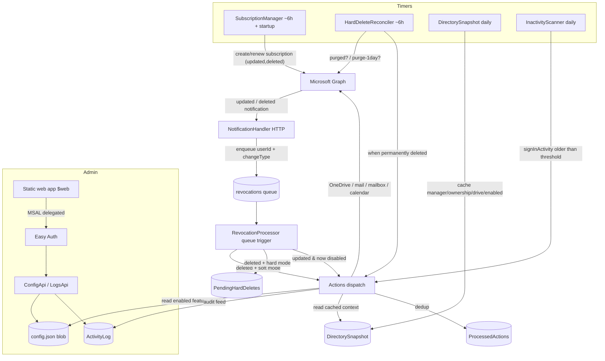

# Architecture

M365AutoRevocate is a PowerShell **Azure Functions** app (Flex Consumption) that
subscribes to Microsoft Graph change notifications and runs configurable
offboarding actions when a user becomes **inactive**, is **disabled** or is **deleted**. It authenticates
with a **managed identity** only. Admins configure it from a static web app in
the storage account ([docs/web-app.md](web-app.md)).

## Components

### Functions

| Function | Trigger | Job |
|----------|---------|-----|
| **NotificationHandler** | HTTP (function key) | Validation handshake; validates `clientState`; enqueues `{userId, changeType}` for `updated`/`deleted`. Returns fast. |
| **RevocationProcessor** | Queue (`revocations`) | `deleted` → soft: act now / hard: record pending. `updated` → if now disabled and disable-features exist, act. |
| **SubscriptionManager** | Timer (~6h + startup) | Creates/renews the `/users` `updated,deleted` subscription. Ensures tables + config container. |
| **HardDeleteReconciler** | Timer (~6h) | For each pending user, checks the recycle bin; acts when purged or 29 days after deletion (one day before the automatic purge). |
| **DirectorySnapshot** | Timer (daily) + seeded at deploy | Mandatory. Caches `userId → manager/profile/enabled/ownership/drive`. |
| **InactivityScanner** | Timer (daily) | Flags enabled accounts inactive past the threshold and runs the inactive-trigger actions. No-op unless enabled in config. |
| **ConfigApi / LogsApi** | HTTP (Easy Auth + token check) | Admin API for the web app: read/save the config blob (incl. first-run wizard flag, exclusion-group resolution by object id, email/forward validation); read the activity log. |
| **GroupsApi** | HTTP (Easy Auth + token check) | Security-group search backing the exclusion-group autocomplete. |
| **StatusApi** | HTTP (Easy Auth + token check) | Diagnostics: subscription health, per-function heartbeats, safety/pause state, dry-run flag, queue + poison depth, snapshot age, permission nudge, version. |
| **PreviewApi** | HTTP (Easy Auth + token check) | What-if count of accounts matching the inactivity threshold (server-side `$count`). |
| **ResumeApi** | HTTP (Easy Auth + token check) | Clears the storm-guard pause (records who resumed). |
| **ReconciliationSweep** | Timer (daily) | Enqueues deletions/disables that were missed because a notification was never delivered. |
| **ActivityLogCleanup** | Timer (weekly) | Activity-log retention (batch delete) + directory-snapshot prune. |
| **Watchdog** | Timer (daily) | Emails the service desk on failing functions, a missing/expired subscription, a stale snapshot, a non-empty poison queue, or a pause. |

Every destructive action passes through a **storm guard** (circuit breaker):
per-trigger daily caps and a percent-of-directory ceiling. On breach the tool
pauses all processing (a `SafetyState` latch), holds queued work with a
visibility delay, and surfaces a "review & resume" banner in the web app. See
[../SECURITY.md](../SECURITY.md).

Every worker function records a heartbeat (last run, status, duration, last
error) into the `FunctionHeartbeats` table via `Invoke-ARFunctionRun`; the
Diagnostics tab reads these through StatusApi, so operators can debug without
opening Application Insights.

### Triggers and the action matrix

Each action is configured (in `config.json`, via the web app) to run **at
inactive**, **at disable**, **at delete**, or any combination.
`Invoke-ARRevocation` takes the trigger, reads the matrix, and runs only the
enabled actions:

- **inactive** fires from the daily scan when an enabled account's
  `lastSuccessfulSignInDateTime` (or `createdDateTime` when never signed in) is
  older than the threshold and the user is not in the exclusion group. The
  account is fully live, so every action is possible - including the
  inactive-only ones (remove licences, remove group memberships, soft delete).
  **Soft delete always runs last**; the other actions need a live account.
- **disable** fires from an `updated` notification when `accountEnabled` becomes
  false. The account still exists, so manager/ownership/OneDrive are read
  directly, and mailbox/calendar actions are possible.
- **delete** fires per the soft/hard timing below; the account is gone, so
  context comes from the directory snapshot.

Idempotency is per `(trigger, userId)` in `ProcessedActions`. Re-enabling a user
clears the disable marker; a user who becomes active again after being flagged
inactive is re-armed by the scanner. A soft delete performed by the inactive
trigger flows into the normal delete pipeline via the Graph notification.

## Soft vs. hard deletion

Graph raises the `deleted` change notification when a user is **soft-deleted**
(moved to the directory recycle bin). There is **no** separate Graph notification
for *permanent* deletion. So:

- **Soft mode** acts on the notification immediately.
- **Hard mode** records the soft-delete, then `HardDeleteReconciler` polls
  `/directory/deletedItems/…/{id}`. Cleanup runs when that returns 404 (manually
  purged) or, at the latest, **29 days after deletion - one day before Entra's
  automatic 30-day purge** - so the actions always run while the object still
  resolves.

## The relationship-loss problem (why DirectorySnapshot exists)

When a user is deleted, Graph **severs their relationships**:
`/users/{id}/manager` and `/users/{id}/ownedObjects` stop resolving, and the
recycle-bin copy will not expand them. That makes "email the manager" and "list
owned artifacts" impossible from the deleted object alone.

`DirectorySnapshot` solves this by caching that context on a schedule **before**
deletion. At cleanup time the tool reads the cache. If the cache is absent (never
ran, or the user was created and deleted between snapshots) the manager step
falls back to the service desk.

The OneDrive still exists for the tenant's retention window after deletion, so it
is located either from the cached `driveId` or by reconstructing the personal
site URL from the UPN.

## State (Azure Storage, AAD-authenticated)

| Store | Key | Contents |
|-------|-----|----------|
| `PendingHardDeletes` (table) | `pending` / userId | Soft-deleted users awaiting permanent deletion + captured identity |
| `DirectorySnapshot` (table) | `user` / userId | Cached manager, profile, accountEnabled, and (optionally) ownership + drive id |
| `ProcessedActions` (table) | trigger / userId | Idempotency guard, partitioned by `inactive` / `disable` / `delete` |
| `ActivityLog` (table) | `log` / (maxTicks-now) | Chronological audit feed shown in the web app |
| `FunctionHeartbeats` (table) | `fn` / function name | Last run/status/duration/error per function (Diagnostics tab) |
| `SafetyState` (table) | `flag`/`count`/`meta` | Storm-guard paused latch, per-trigger daily counters, directory size |
| `config.json` (blob) | - | Editable behavioural config (matrix, timing, contacts, inactivity, safety) |
| `config.previous.json` / `snapshot-state.json` / `subscription-state.json` (blob) | - | Config rollback copy; snapshot delta cursor; subscription record |

## Idempotency & safety

- Each action set checks `ProcessedActions[(trigger,userId)]` and no-ops if
  already done, so duplicate notifications and queue retries are safe.
- Behavioural config is read fresh from the blob per event (web edits apply at
  once) and is **sanitised against the catalog** on read and on save, so an
  unsupported trigger can never be enabled even by a hand-crafted request.
- **Simulation (dry run)** is a behaviour setting in the config blob (edited from
  the web app, **Configuration → Simulation mode**). When on, the tool performs
  all reads/enumeration and logs exactly what *would* happen, changing nothing -
  new installs start this way for a safe first run. Dry-run events are still
  written to `ActivityLog`. Because it lives in the config blob, flipping it takes
  effect within the behaviour-config TTL (no restart needed).
- The high-volume `updated` (disable) path short-circuits before any Graph call
  when no disable-actions are configured.
